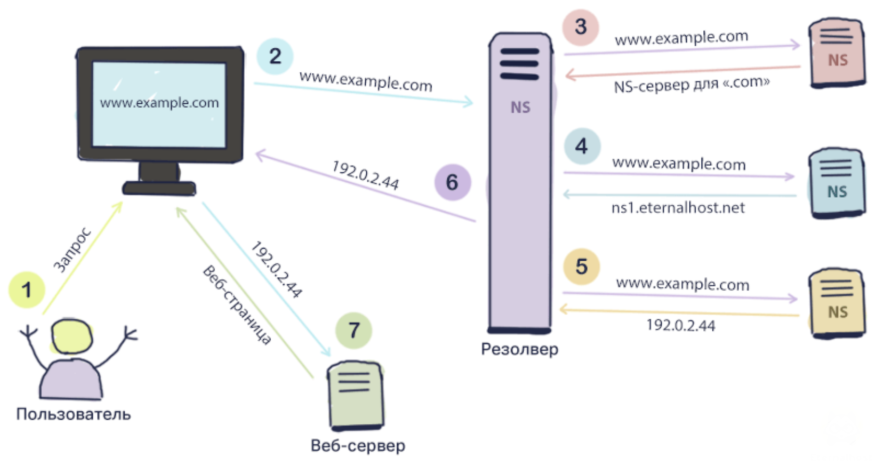

|||
|---|---|
|ДИСЦИПЛИНА|Методы защиты информации
|ИНСТИТУТ|ИПИТ
|КАФЕДРА|передовых технологий
|ВИД УЧЕБНОГО МАТЕРИАЛА|Методические указания к практическим занятиям|
|ПРЕПОДАВАТЕЛЬ|Дворецкий Артур Геннадьевич|
|СЕМЕСТР|3 семестр, 2026/2027 уч. год|

Ссылка на материал: <br>
https://github.com/dv0retsky/secur-tutorial/blob/main/MZI2_Networks/MZI2_Networks.md

---

# Практическое занятие №2: Компьютерные сети

# 🕸️ Компьютерная сеть и сетевое взаимодействие

**Компьютерная сеть** — совокупность вычислительных устройств, соединённых каналами связи и обменивающихся данными в соответствии с определёнными правилами — сетевыми протоколами.

В простейшем случае сеть может состоять из двух компьютеров, соединённых кабелем. В реальных информационных системах она включает рабочие станции, серверы, маршрутизаторы, коммутаторы, беспроводные точки доступа, мобильные устройства, сетевые хранилища и специализированное оборудование.

Основная задача сети заключается в передаче данных между отправителем и получателем. Для этого необходимо решить сразу несколько задач: определить адрес получателя, выбрать путь до него, передать данные по физической среде, доставить их нужному приложению и при необходимости обеспечить контроль целостности, подтверждение доставки и защиту передаваемой информации.

**Сетевой протокол** — формализованный набор правил, определяющий формат сообщений, порядок их передачи, способы адресации и действия участников сетевого взаимодействия.

Например, HTTP определяет правила обмена данными между веб-клиентом и веб-сервером, IP отвечает за сетевую адресацию и доставку пакетов между сетями, а Ethernet описывает передачу кадров внутри локального сегмента.

## Виды компьютерных сетей

Сети можно классифицировать по масштабу.

**LAN (Local Area Network)** — локальная вычислительная сеть. Обычно объединяет устройства в пределах квартиры, лаборатории, офиса, здания или небольшого комплекса зданий.

**WAN (Wide Area Network)** — территориально распределённая сеть, соединяющая удалённые локальные сети. Наиболее известным примером является Интернет.

Между этими понятиями встречаются и промежуточные варианты, например MAN — городские сети. Однако для первоначального изучения достаточно понимать ключевое отличие: в локальной сети устройства могут взаимодействовать через общую локальную инфраструктуру, а при обмене между различными сетями требуется маршрутизация.

Пример домашней сети:

```text
              Интернет
                  |
            [Маршрутизатор]
             /     |      \
            /      |       \
          [ПК] [Ноутбук] [Смартфон]
```

Если компьютер обращается к другому устройству внутри той же локальной сети, обмен может происходить непосредственно через коммутатор или встроенный коммутатор маршрутизатора. Если же адрес назначения находится за пределами локальной сети, трафик передаётся через шлюз.

---

# 🕸️  Зачем нужны сетевые модели

Передача данных является многоэтапным процессом. Если описывать её как единую операцию, проектирование оборудования и программного обеспечения становится чрезвычайно сложным.

Поэтому сетевое взаимодействие принято разделять на уровни. Каждый уровень решает собственную задачу и взаимодействует с соседними уровнями через определённые интерфейсы.

Такой подход позволяет разрабатывать сетевые технологии независимо друг от друга. Создателю браузера не нужно реализовывать передачу электрических сигналов по кабелю, а производителю сетевой карты не нужно знать, какие веб-приложения будут работать на компьютере. Для специалиста по информационной безопасности уровневый подход также полезен: он позволяет анализировать угрозы отдельно на физическом, канальном, сетевом, транспортном и прикладном уровнях.

Наиболее известны две модели:

- **OSI** — концептуальная семиуровневая модель;
- **TCP/IP** — практическая модель, лежащая в основе современного Интернета.

---

# 🕸️ Модель OSI

**OSI (Open Systems Interconnection)** — эталонная модель взаимодействия открытых систем, разработанная Международной организацией по стандартизации ISO.

Модель OSI не является отдельным сетевым протоколом. Это логическая схема, которая помогает структурировать сетевые технологии и понимать, на каком уровне выполняется определённая функция.

Модель включает семь уровней:

| № | Уровень | Английское название | Основная задача |
|---|---|---|---|
| 7 | Прикладной | Application | Взаимодействие сетевых приложений |
| 6 | Представления | Presentation | Представление и преобразование данных |
| 5 | Сеансовый | Session | Управление сеансами |
| 4 | Транспортный | Transport | Доставка данных между приложениями |
| 3 | Сетевой | Network | Межсетевой обмен и маршрутизация |
| 2 | Канальный | Data Link | Передача кадров в локальном сегменте |
| 1 | Физический | Physical | Передача сигналов по физической среде |

## Физический уровень

**Физический уровень (Physical Layer)** определяет способы передачи отдельных битов по среде связи.

На этом уровне рассматриваются электрические и оптические сигналы, радиоволны, разъёмы, кабели, частоты и другие физические характеристики передачи. К нему относятся витая пара, оптоволокно, физическая часть Ethernet и радиоканал Wi-Fi.

На физическом уровне ещё нет понятия IP-адреса, веб-сайта или TCP-соединения. Для оборудования существуют сигналы, кодирующие последовательность нулей и единиц.

С точки зрения защиты информации физический уровень особенно важен в ситуациях, когда злоумышленник получает физический доступ к кабельной системе, сетевому оборудованию или серверной инфраструктуре. Поэтому меры физической защиты являются частью общей системы информационной безопасности.

## Канальный уровень

**Канальный уровень (Data Link Layer)** обеспечивает передачу данных между узлами, находящимися в одном сетевом сегменте.

Основной единицей данных здесь является **кадр (frame)**. На этом уровне работает Ethernet, а для идентификации сетевых интерфейсов используются MAC-адреса.

Типичное устройство канального уровня — **коммутатор (switch)**. Коммутатор принимает Ethernet-кадр, анализирует MAC-адрес назначения и решает, через какой порт передать кадр дальше.

```text
ПК A
MAC: AA:AA:AA:AA:AA:AA
        |
        v
   [Коммутатор]
        |
        v
ПК B
MAC: BB:BB:BB:BB:BB:BB
```

Коммутатору не требуется знать адрес сайта или содержимое HTTP-запроса. Для его задачи достаточно информации канального уровня.

## Сетевой уровень

**Сетевой уровень (Network Layer)** отвечает за передачу данных между различными сетями.

Основным протоколом является **IP (Internet Protocol)**. Устройство, выполняющее типичную функцию этого уровня, — **маршрутизатор (router)**. Он анализирует IP-адрес назначения и выбирает следующий участок пути.

Единицей данных сетевого уровня обычно называют **пакет (packet)**.

На этом уровне рассматриваются:

- IPv4 и IPv6;
- сеть и подсеть;
- маска подсети;
- шлюз;
- маршрут;
- маршрутизация.

## Транспортный уровень

**Транспортный уровень (Transport Layer)** обеспечивает логическое взаимодействие между приложениями на конечных устройствах.

Наиболее известные транспортные протоколы — TCP и UDP.

TCP способен устанавливать соединение, контролировать порядок следования данных и повторно передавать потерянные фрагменты. UDP работает проще и не гарантирует доставку на уровне самого протокола.

На транспортном уровне используются **порты**, позволяющие определить, какому приложению предназначены полученные данные.

## Сеансовый уровень

**Сеансовый уровень (Session Layer)** концептуально отвечает за установление, поддержание и завершение сеансов взаимодействия между приложениями.

В современных сетевых стеках эти функции часто реализуются непосредственно прикладными протоколами и библиотеками, поэтому в модели TCP/IP отдельный сеансовый уровень обычно не выделяется.

## Уровень представления

**Уровень представления (Presentation Layer)** отвечает за то, в каком виде данные передаются приложению.

К его функциям концептуально относят преобразование форматов, кодирование, сериализацию, сжатие и шифрование.

Например, принимающая сторона должна понимать, в какой кодировке представлен текст и каким образом интерпретировать передаваемое изображение или структурированный документ.

## Прикладной уровень

**Прикладной уровень (Application Layer)** находится ближе всего к сетевым приложениям.

Примерами протоколов прикладного уровня являются:

| Протокол | Назначение |
|---|---|
| HTTP/HTTPS | Передача веб-данных |
| DNS | Разрешение доменных имён |
| SMTP | Отправка электронной почты |
| IMAP/POP3 | Получение электронной почты |
| SSH | Защищённое удалённое управление |
| FTP | Передача файлов |

Прикладной уровень не следует путать с самим приложением. Браузер — это программа, которая использует протоколы прикладного уровня, например HTTP и HTTPS.

---

# 🕸️ Модель TCP/IP

В отличие от OSI, модель **TCP/IP** тесно связана с реально используемым стеком протоколов Интернета.

В литературе встречаются четырёх- и пятиуровневые варианты представления TCP/IP. В данном занятии будем использовать четырёхуровневую схему:

| Уровень TCP/IP | Примерное соответствие OSI | Примеры |
|---|---|---|
| Прикладной | 5–7 | HTTP, HTTPS, DNS, SMTP, SSH |
| Транспортный | 4 | TCP, UDP |
| Межсетевой | 3 | IPv4, IPv6, ICMP |
| Канальный | 1–2 | Ethernet, Wi-Fi |

Такое сопоставление является условным. Модели создавались для разных целей, поэтому не следует ожидать абсолютно точного соответствия каждого протокола отдельному уровню OSI.

---

# 🕸️ Инкапсуляция данных

При передаче информации данные последовательно проходят сверху вниз по стеку протоколов. Каждый уровень добавляет собственную служебную информацию. Этот процесс называется **инкапсуляцией**.

Рассмотрим отправку HTTP-запроса:

```text
Прикладные данные
       |
       v
+-----------------------+
| TCP-заголовок | Данные|
+-----------------------+
       |
       v
+-----------------------------------+
| IP-заголовок | TCP | Данные       |
+-----------------------------------+
       |
       v
+---------------------------------------------+
| Ethernet | IP | TCP | Данные | служебные поля |
+---------------------------------------------+
       |
       v
       Биты
```

На стороне получателя происходит обратный процесс — **деинкапсуляция**. Сетевая карта принимает кадр, затем операционная система обрабатывает IP-пакет, транспортный протокол извлекает полезные данные и передаёт их приложению.

Именно поэтому при анализе сетевого трафика важно понимать, что один и тот же обмен одновременно содержит данные нескольких уровней.

---

# 🕸️ Как происходит обращение к веб-сайту

Предположим, пользователь вводит адрес сайта в браузере.

Сначала браузеру необходимо определить IP-адрес сервера. Для этого выполняется DNS-разрешение имени. После получения IP-адреса операционная система определяет, находится ли сервер в той же локальной сети. Если адрес удалённый, пакет передаётся на шлюз по умолчанию.

Для формирования Ethernet-кадра необходимо узнать MAC-адрес следующего узла, например шлюза. В IPv4-сети для этого обычно используется ARP.

Затем транспортный протокол устанавливает связь с нужным сервисом. При использовании HTTPS дополнительно формируется защищённое TLS-соединение. После этого браузер передаёт HTTP-запрос, сервер формирует ответ, а ответ проходит обратный путь.

То, что для пользователя выглядит как одно действие — «открыть сайт», фактически включает согласованную работу нескольких протоколов.

# 🕸️ TCP и UDP

## TCP

**TCP (Transmission Control Protocol)** — транспортный протокол с установлением соединения, обеспечивающий надёжную доставку байтового потока между приложениями.

Перед началом передачи стороны устанавливают соединение. Классический процесс называется **трёхэтапным рукопожатием (three-way handshake)**:

```text
Клиент                         Сервер
  |                              |
  | -------- SYN ------------->  |
  | <----- SYN + ACK ----------  |
  | -------- ACK ------------->  |
  |                              |
       Соединение установлено
```

После установления соединения TCP контролирует последовательность передаваемых данных. Если отдельный сегмент не был получен, он может быть передан повторно.

К важнейшим свойствам TCP относятся:

- установление соединения;
- нумерация и упорядочивание данных;
- подтверждение получения;
- повторная передача потерянных данных;
- управление потоком;
- контроль перегрузки.

TCP применяется там, где приложение должно получить корректный поток данных даже ценой дополнительных задержек. Это характерно для веб-взаимодействия, SSH, электронной почты и большого количества других сетевых сервисов.

Следует понимать, что «надёжность TCP» означает надёжность доставки внутри транспортного соединения. TCP сам по себе не гарантирует подлинность удалённого сервера и не шифрует данные. Поэтому для защищённой передачи поверх TCP применяются дополнительные протоколы, например TLS.

## UDP

**UDP (User Datagram Protocol)** — транспортный протокол без установления соединения и без встроенной гарантии доставки.

UDP имеет меньше служебных механизмов, чем TCP. Отправитель передаёт дейтаграмму, но сам UDP не требует подтверждения её получения, не гарантирует порядок доставки и не выполняет повторную передачу.

Это делает его удобным для задач, где минимальная задержка важнее доставки каждого отдельного сообщения. UDP используется в DNS, голосовой и видеосвязи, сетевых играх, потоковой передаче и в качестве основы для некоторых современных протоколов, которые реализуют собственные механизмы надёжности.

| Характеристика | TCP | UDP |
|---|---|---|
| Установление соединения | Да | Нет |
| Подтверждение доставки | Да | Нет на уровне UDP |
| Контроль порядка | Да | Нет |
| Повторная передача | Да | Нет |
| Накладные расходы | Выше | Ниже |
| Типичная задача | Надёжный поток данных | Быстрая передача сообщений |

Неверно считать UDP «плохой версией TCP». Это два разных транспортных механизма, предназначенных для разных требований.

---

# 🕸️ Адресация на транспортном уровне: порты

IP-адрес позволяет определить сетевой узел, но одного IP-адреса недостаточно. На одном компьютере одновременно могут работать браузер, почтовый клиент, SSH-сервер, система мониторинга и другие приложения.

Для идентификации логической точки взаимодействия TCP и UDP используют **номера портов**.

**Порт** — числовой идентификатор, используемый транспортным протоколом для доставки данных конкретному приложению или сетевому сервису.

Номер порта представлен 16-битным значением и находится в диапазоне от `0` до `65535`.

Порты принято условно делить на диапазоны:

| Диапазон | Назначение |
|---|---|
| 0–1023 | Общеизвестные системные порты |
| 1024–49151 | Зарегистрированные порты |
| 49152–65535 | Динамические и частные порты |

Примеры общеизвестных сервисов:

| Сервис | Типичный порт |
|---|---:|
| FTP | 21/TCP |
| SSH | 22/TCP |
| SMTP | 25/TCP |
| DNS | 53/UDP и 53/TCP |
| HTTP | 80/TCP |
| HTTPS | 443/TCP |
| IMAP | 143/TCP |
| IMAPS | 993/TCP |

Важно различать номер порта и физический разъём. Сетевой порт TCP/UDP — логическое понятие.

Например, когда браузер пользователя обращается к HTTPS-серверу, адрес назначения может быть представлен как:

```text
203.0.113.20:443/TCP
```

При этом клиент обычно использует временный исходящий порт, например:

```text
192.168.1.10:53124/TCP
```

Тогда конкретное соединение можно описать парой конечных точек:

```text
192.168.1.10:53124  <----TCP---->  203.0.113.20:443
```

## Сокет

Термин **сокет** используется для обозначения программной конечной точки сетевого взаимодействия.

В упрощённом виде сокет можно связать с комбинацией:

```text
IP-адрес + транспортный протокол + номер порта
```

Для уже установленного TCP-соединения поток однозначно определяется сочетанием адресов и портов обеих сторон.

---

# 🕸️ IP-адресация

## Что такое IP-адрес

**IP-адрес** — логический адрес сетевого интерфейса, используемый протоколом IP для идентификации узла и маршрутизации пакетов.

IP-адрес относится к сетевому уровню. Он зависит от того, к какой IP-сети подключён интерфейс, и может изменяться при переходе устройства в другую сеть.

В современном Интернете используются две основные версии протокола:

- IPv4;
- IPv6.

---

# 🕸️ IPv4

**IPv4 (Internet Protocol version 4)** использует 32-битные адреса.

Для удобства адрес записывается в виде четырёх десятичных чисел от 0 до 255, разделённых точками:

```text
192.168.1.100
```

В двоичном виде этот адрес состоит из 32 бит.

Адрес IPv4 логически содержит две части:

- номер сети;
- номер узла внутри сети.

Граница между ними определяется маской подсети или длиной префикса CIDR.

## Маска подсети

**Маска подсети** — 32-битное значение, показывающее, какие биты IPv4-адреса относятся к сетевой части.

Например:

```text
IP-адрес:       192.168.1.100
Маска:          255.255.255.0
CIDR:           /24
```

Префикс `/24` означает, что первые 24 бита относятся к номеру сети.

Для этого примера адрес сети:

```text
192.168.1.0/24
```

При такой маске адреса от `192.168.1.0` до `192.168.1.255` относятся к одной подсети. В традиционной IPv4-подсети `/24` адрес `192.168.1.0` является адресом сети, а `192.168.1.255` — широковещательным адресом.

Обычным узлам могут назначаться адреса:

```text
192.168.1.1
...
192.168.1.254
```

## Зачем нужны подсети

Разделение адресного пространства на подсети позволяет:

- логически отделять группы устройств;
- ограничивать широковещательный домен;
- упрощать маршрутизацию;
- реализовывать сегментацию;
- применять разные правила безопасности для разных групп узлов.

Например, в организации можно отделить пользовательские рабочие станции от серверного сегмента и гостевой беспроводной сети.

---

# 🕸️ Частные IPv4-адреса

В локальных сетях широко применяются диапазоны частных IPv4-адресов:

```text
10.0.0.0/8
172.16.0.0/12
192.168.0.0/16
```

Такие адреса не используются для прямой глобальной маршрутизации в Интернете.

Поэтому домашний компьютер может иметь адрес:

```text
192.168.1.20
```

а доступ к внешним ресурсам выполнять через публичный адрес маршрутизатора.

## NAT

**NAT (Network Address Translation)** — механизм преобразования сетевых адресов при прохождении трафика через промежуточное устройство.

Типичная домашняя сеть может выглядеть так:

```text
192.168.1.10 \
192.168.1.11  > [NAT-маршрутизатор] ---> Публичный IP ---> Интернет
192.168.1.12 /
```

NAT позволил существенно снизить потребность в публичных IPv4-адресах. Однако сам факт применения NAT не следует рассматривать как полноценную защиту сети. Политика безопасности должна обеспечиваться отдельными механизмами фильтрации, контроля доступа и безопасной конфигурации.

---

# 🕸️ IPv6

**IPv6 (Internet Protocol version 6)** использует 128-битные адреса.

Пример полного адреса:

```text
2001:db8:85a3:0000:0000:8a2e:0370:7334
```

IPv6 записывается группами шестнадцатеричных чисел. Повторяющиеся нулевые группы можно сокращать.

Например:

```text
2001:db8:0:0:0:0:0:1
```

может быть записан как:

```text
2001:db8::1
```

Главным мотивом появления IPv6 стало исчерпание доступного пространства IPv4. Количество возможных IPv6-адресов чрезвычайно велико по сравнению с IPv4.

При этом не следует считать IPv6 автоматически безопасным. Безопасность по-прежнему зависит от правильной настройки узлов, маршрутизаторов, межсетевых экранов и прикладных протоколов.

---

# 🕸️ Маршрутизация

**Маршрутизация** — процесс выбора пути, по которому IP-пакет должен быть передан к сети назначения.

Если два узла находятся в одной подсети, они могут взаимодействовать в пределах локального сегмента. Если адрес назначения принадлежит другой сети, пакет передаётся маршрутизатору.

Маршрутизатор хранит **таблицу маршрутизации**, где содержатся сведения о известных сетях и способах передачи пакетов к ним.

Пример:

```text
ПК
192.168.1.100
     |
     | локальная сеть
     v
Маршрутизатор
192.168.1.1
     |
     v
   Интернет
     |
     v
Удалённый сервер
```

Адрес маршрутизатора, на который узел отправляет пакеты для неизвестных удалённых сетей, обычно называют **шлюзом по умолчанию**.

## Как узел принимает решение

Предположим:

```text
Адрес компьютера: 192.168.1.100/24
Адрес назначения: 192.168.1.25
```

Оба адреса находятся в сети `192.168.1.0/24`, следовательно, получатель локальный.

Другой пример:

```text
Адрес компьютера: 192.168.1.100/24
Адрес назначения: 203.0.113.20
```

Адрес `203.0.113.20` не относится к локальной подсети, поэтому пакет направляется шлюзу, например `192.168.1.1`.

Маршрутизатор затем определяет следующий узел. Отдельному маршрутизатору не обязательно знать весь путь до конечного сервера. Ему достаточно выбрать подходящий **next hop**.

---

# 🕸️ MAC-адреса

## Что такое MAC-адрес

**MAC-адрес (Media Access Control address)** — идентификатор сетевого интерфейса, используемый на канальном уровне для доставки кадров в локальном сетевом сегменте.

Классический MAC-адрес Ethernet имеет длину 48 бит, или 6 байт.

Пример:

```text
00:1A:2B:3C:4D:5E
```

Встречается и запись через дефисы:

```text
00-1A-2B-3C-4D-5E
```

Часто MAC-адрес описывают как уникальный и неизменяемый аппаратный адрес. Для вводного уровня такая формулировка удобна, но технически она не совсем точна.

Современные операционные системы позволяют программно изменять MAC-адрес интерфейса. Кроме того, смартфоны и ноутбуки могут использовать **MAC randomization** — случайные адреса для отдельных беспроводных сетей, чтобы уменьшить возможность отслеживания устройства.

Поэтому корректнее говорить, что MAC-адрес используется как идентификатор интерфейса на канальном уровне, а не как гарантированно неизменяемый идентификатор конкретного физического устройства.

## Отличие MAC от IP

MAC- и IP-адреса решают разные задачи.

| Характеристика | MAC-адрес | IP-адрес |
|---|---|---|
| Уровень | Канальный | Сетевой |
| Основная задача | Доставка кадра в локальном сегменте | Доставка пакета между IP-сетями |
| Тип адресации | Канальная | Логическая |
| Может изменяться | Да | Да |
| Используется для глобальной маршрутизации | Нет | Да |

Удобно использовать аналогию: IP-адрес помогает определить, к какой сети и какому узлу нужно доставить пакет, а MAC-адрес нужен для передачи кадра конкретному интерфейсу на текущем локальном участке пути.

---

# 🕸️ ARP

Если компьютер знает IPv4-адрес соседнего узла, для формирования Ethernet-кадра ему необходимо узнать MAC-адрес.

Эту задачу решает **ARP (Address Resolution Protocol)**.

ARP используется для сопоставления IPv4-адреса с MAC-адресом в локальном сегменте.

Пусть устройство хочет передать данные узлу:

```text
192.168.1.52
```

но его MAC-адрес неизвестен.

Устройство отправляет широковещательный ARP-запрос, смысл которого можно передать так:

```text
Кто имеет IP 192.168.1.52?
Сообщите 192.168.1.10.
```

Нужный узел отвечает:

```text
192.168.1.52 соответствует MAC 00:1A:2B:3C:4D:5E
```

Полученная информация временно сохраняется в **ARP-кэше**.

## Почему для удалённого сервера не нужен его MAC

Предположим, компьютер обращается к серверу в Интернете.

Он не пытается узнать MAC-адрес самого удалённого сервера, потому что Ethernet-кадр используется только на текущем локальном участке сети.

Если сервер находится за пределами локальной подсети, компьютеру нужен MAC-адрес **шлюза**, а не конечного сервера.

Упрощённо:

```text
ПК
IP назначения: удалённый сервер
MAC назначения кадра: локальный шлюз
        |
        v
Маршрутизатор
```

На следующем сетевом участке кадр будет сформирован заново с другими MAC-адресами, а IP-адрес назначения в пакете сохранится.

Это один из важнейших моментов для понимания различия второго и третьего уровней модели OSI.

---

# 🕸️ ARP и безопасность

Классический ARP не содержит криптографического механизма проверки подлинности ARP-сообщения. Это создаёт возможность атак типа **ARP spoofing** или **ARP poisoning**.

При такой атаке злоумышленник пытается убедить узел, что определённый IPv4-адрес соответствует MAC-адресу атакующего.

Например, атакующее устройство может попытаться представить себя как шлюз:

```text
Настоящий шлюз:
192.168.1.1 -> AA:AA:AA:AA:AA:AA

Ложное сообщение:
192.168.1.1 -> EE:EE:EE:EE:EE:EE
```

Если подмена успешно влияет на ARP-кэш клиента, часть трафика может быть направлена не тому устройству.

С точки зрения модели CIA здесь потенциально затрагиваются конфиденциальность и целостность, а в некоторых сценариях и доступность.

Для защиты применяются:

- сегментация сети;
- функции защиты коммутаторов;
- контроль аномалий ARP;
- привязка адресов в критичных сегментах;
- защищённые прикладные протоколы;
- мониторинг сетевых событий.

Даже если злоумышленник оказался на пути передачи, использование TLS затрудняет чтение или незаметное изменение содержимого корректно защищённого HTTPS-трафика.

---

# 🕸️ DHCP

В большинстве локальных сетей пользователю не требуется вручную задавать сетевые параметры.

Эту задачу выполняет **DHCP (Dynamic Host Configuration Protocol)**.

DHCP позволяет автоматически предоставить устройству:

- IPv4-адрес;
- маску подсети;
- шлюз по умолчанию;
- DNS-серверы;
- срок аренды адреса;
- дополнительные параметры.

Классический процесс DHCP для IPv4 часто описывают последовательностью **DORA**:

```text
Discover
   ↓
Offer
   ↓
Request
   ↓
Acknowledge
```

Клиент сначала пытается обнаружить DHCP-сервер. Сервер предлагает конфигурацию. Клиент выбирает предложение и запрашивает его, после чего сервер подтверждает назначение.

С точки зрения безопасности важно понимать, что DHCP влияет на базовую сетевую конфигурацию узла. Если пользователь получает некорректный шлюз или DNS-сервер, его трафик может направляться неожиданным образом. Поэтому в корпоративных сетях применяются механизмы контроля DHCP и доступа к сетевому сегменту.

# 🕸️ DNS

## Что такое DNS

Пользователям удобно работать с именами:

```text
example.com
```

Сетевому уровню для передачи пакетов необходим IP-адрес.

**DNS (Domain Name System)** — распределённая иерархическая система доменных имён, которая позволяет сопоставлять доменные имена с различной служебной информацией, прежде всего с IP-адресами.

<div align="center">
  
</div>

DNS часто сравнивают с телефонной книгой Интернета. Такая аналогия полезна для первого знакомства, но она упрощает реальное устройство системы. DNS хранит не только соответствия «имя — IP-адрес», но и сведения о почтовых серверах, авторитетных серверах домена и другую информацию.

## Зачем нужен DNS

Без DNS пользователю пришлось бы запоминать числовые IP-адреса серверов.

Вместо:

```text
203.0.113.20
```

удобнее использовать:

```text
example.com
```

Кроме того, доменное имя может продолжать использоваться после переноса веб-сервиса на другой IP-адрес. Администратор изменяет DNS-запись, а пользователи продолжают обращаться к тому же имени.

---

# 🕸️ Как работает DNS

Рассмотрим упрощённый сценарий.

Пользователь вводит:

```text
www.example.com
```

Браузеру необходимо узнать IP-адрес сервера. Сначала система может проверить локальный DNS-кэш. Если нужной записи нет, запрос отправляется настроенному **рекурсивному DNS-резолверу**.

Если резолвер не располагает ответом в собственном кэше, он может обращаться к иерархии DNS.

```text
Пользователь
    |
    v
Рекурсивный DNS-резолвер
    |
    +--> Корневые DNS-серверы
    |
    +--> Серверы домена верхнего уровня (.com)
    |
    +--> Авторитетный DNS-сервер example.com
    |
    v
IP-адрес
```

Корневой DNS-сервер не обязан знать IP-адрес конкретного сайта. Его задача — указать, где искать информацию о соответствующем домене верхнего уровня.

Далее сервер домена верхнего уровня указывает авторитетные серверы нужной DNS-зоны, а уже авторитетный сервер может вернуть требуемую запись.

После получения результата рекурсивный резолвер передаёт его клиенту и обычно сохраняет в кэше на определённое время.

---

# 🕸️ Иерархия DNS

Для имени:

```text
www.example.com
```

можно условно выделить:

```text
.            корень DNS
com          домен верхнего уровня
example      домен второго уровня
www          имя узла или поддомен
```

DNS является распределённой системой. Не существует одного сервера, содержащего полную актуальную базу всех доменных имён Интернета.

Такой подход обеспечивает масштабируемость и распределение ответственности между владельцами различных зон.

---

# 🕸️ Основные типы DNS-записей

DNS-зона содержит записи разных типов.

| Тип записи | Назначение |
|---|---|
| A | Связывает доменное имя с IPv4-адресом |
| AAAA | Связывает доменное имя с IPv6-адресом |
| CNAME | Указывает каноническое имя для псевдонима |
| MX | Определяет почтовые серверы домена |
| NS | Указывает авторитетные DNS-серверы зоны |
| TXT | Хранит текстовые данные |
| PTR | Используется для обратного разрешения IP-адресов |
| SOA | Содержит основные служебные параметры DNS-зоны |

Простейший пример A-записи можно представить так:

```text
example.com -> 203.0.113.20
```

А AAAA-запись связывает доменное имя уже с IPv6-адресом.

---

# 🕸️ TTL и DNS-кэширование

DNS-запросы не обязательно каждый раз проходят всю иерархию. Полученные ответы кэшируются.

**TTL (Time To Live)** в DNS определяет, сколько времени запись может храниться в кэше до повторного запроса.

Если TTL равен 3600 секундам, запись может использоваться в течение одного часа.

Кэширование уменьшает задержки и нагрузку на DNS-серверы, но приводит к тому, что изменения DNS-записей становятся видимыми не мгновенно.

---

# 🕸️ DNS и безопасность

DNS играет критически важную роль: если пользователь получит неправильный IP-адрес, он может обратиться не к тому серверу, который ожидал.

Одной из угроз является **DNS spoofing** — подмена DNS-ответа.

Похожий класс атак — **DNS cache poisoning**, при котором злоумышленник пытается поместить ложные сведения в кэш DNS-резолвера.

Также возможен **DNS hijacking** — изменение DNS-настроек или инфраструктуры таким образом, чтобы запросы пользователя обрабатывались нежелательным сервером.

Отдельно следует учитывать фишинговые домены, которые визуально напоминают легитимные:

```text
example.com
examp1e.com
```

Во втором варианте буква `l` заменена цифрой `1`.

Для повышения доверия к DNS-данным используется **DNSSEC**. Он позволяет проверять цифровую подпись определённых DNS-данных и снижает риск их незаметной подмены.

При этом DNSSEC не предназначен для шифрования DNS-запросов. Для конфиденциальной передачи DNS-запросов применяются другие механизмы, например DNS over HTTPS и DNS over TLS.

---

# 🕸️ ICMP и базовая диагностика сети

Для передачи служебных сообщений в IP-сетях используется **ICMP (Internet Control Message Protocol)**.

Он применяется для сообщений об ошибках и сетевой диагностики.

Одна из самых известных команд:

```bash
ping example.com
```

Она позволяет проверить, отвечает ли узел на соответствующие ICMP-сообщения, а также приблизительно оценить задержку.

При этом отсутствие ответа на `ping` не доказывает, что сервер полностью недоступен. Межсетевой экран может блокировать ICMP, в то время как, например, HTTPS остаётся доступным.

## traceroute и tracert

Для исследования маршрута используются:

Windows:

```powershell
tracert example.com
```

Linux/macOS:

```bash
traceroute example.com
```

Команда показывает последовательность промежуточных узлов — **хопов (hops)** — которые отвечают на диагностические сообщения.

Некоторые промежуточные маршрутизаторы могут не отвечать. Поэтому наличие `*` в выводе не обязательно означает разрыв маршрута.

Кроме того, прямой и обратный маршруты в Интернете не обязаны совпадать.

---

# 🕸️ Как узнать сетевые параметры устройства

## Windows

Для просмотра основной конфигурации:

```powershell
ipconfig /all
```

Команда позволяет увидеть:

- IPv4- и IPv6-адреса;
- маску подсети;
- шлюз;
- DNS-серверы;
- MAC-адрес интерфейса;
- сведения DHCP.

ARP-таблица:

```powershell
arp -a
```

Таблица маршрутизации:

```powershell
route print
```

или:

```powershell
netstat -r
```

Сведения о текущих соединениях:

```powershell
netstat -ano
```

## Linux

Интерфейсы и адреса:

```bash
ip addr
```

или:

```bash
ip a
```

Состояние интерфейсов и MAC-адреса:

```bash
ip link
```

Соседние узлы:

```bash
ip neigh
```

Таблица маршрутизации:

```bash
ip route
```

Сетевые сокеты:

```bash
ss -tuln
```

## 25.3. macOS

Интерфейсы:

```bash
ifconfig
```

Маршруты:

```bash
netstat -rn
```

ARP-кэш:

```bash
arp -a
```

---

# 🕸️ Просмотр DNS-информации

В Windows можно использовать:

```powershell
nslookup example.com
```

На Linux и macOS часто применяется:

```bash
dig example.com
```

Запрос IPv4-записи:

```bash
dig example.com A
```

Запрос IPv6-записи:

```bash
dig example.com AAAA
```

Почтовые серверы:

```bash
dig example.com MX
```

Авторитетные DNS-серверы:

```bash
dig example.com NS
```

Для учебного анализа важно не просто запустить команду, но и понять, какие данные она показывает и на каком уровне сетевого взаимодействия они используются.

---

# 🕸️ Сетевые угрозы с точки зрения модели CIA

Сетевые атаки могут нарушать все три базовых свойства информационной безопасности.

| Угроза | Возможный результат | Свойство CIA |
|---|---|---|
| Перехват незашифрованного трафика | Раскрытие передаваемых данных | Конфиденциальность |
| Подмена сетевого сообщения | Изменение данных | Целостность |
| Перегрузка сетевого сервиса | Нарушение работы | Доступность |
| ARP spoofing | Перенаправление локального трафика | Конфиденциальность / целостность |
| DNS spoofing | Перенаправление на ложный ресурс | Целостность / конфиденциальность |
| Подмена беспроводной точки доступа | Перехват или перенаправление | Конфиденциальность |
| Ошибка сетевой конфигурации | Несанкционированный доступ | Конфиденциальность / целостность |

Сетевая безопасность строится не одним механизмом. Обычно используется несколько взаимодополняющих мер: шифрование, фильтрация, сегментация, аутентификация, мониторинг и безопасная конфигурация.

---

# 🕸️ Межсетевой экран

**Межсетевой экран (firewall)** — программное или аппаратно-программное средство, которое контролирует сетевой трафик в соответствии с заданными правилами.

Правило может учитывать:

```text
адрес источника
адрес назначения
протокол
порт
направление соединения
```

Например, веб-серверу может быть разрешён входящий TCP-трафик на порт 443, а административный интерфейс может быть доступен только из внутренней сети.

Межсетевой экран не делает систему безопасной автоматически. Если правила сформулированы неправильно, фильтрация может оказаться слишком слабой или, наоборот, нарушить нормальную работу системы.

---

# 🕸️ Сегментация сети

**Сегментация сети** — разделение инфраструктуры на логические или физические части с контролируемым взаимодействием между ними.

Если все устройства находятся в одном большом сегменте, компрометация одного узла может облегчить дальнейшее распространение атаки.

Более безопасная архитектура может выглядеть так:

```text
Пользовательская сеть
        |
   [Межсетевой экран]
        |
Серверный сегмент

Гостевой Wi-Fi
        |
   отдельные правила
        |
     Интернет
```

Сегментация позволяет ограничить область распространения инцидента и применять разные политики безопасности для разных категорий устройств.

---

# 🕸️ Шифрование сетевого трафика

Перехват пакетов сам по себе не всегда означает компрометацию содержимого.

Если прикладной протокол передаёт данные в открытом виде, устройство, находящееся на пути трафика, потенциально может прочитать их.

Если же используется криптографически защищённый протокол, например HTTPS, SSH или современный VPN, содержимое передаётся в зашифрованном виде.

Это демонстрирует важный принцип защиты информации:

> безопасность сети не должна строиться только на предположении, что злоумышленник никогда не увидит передаваемые пакеты.

Гораздо надёжнее проектировать систему так, чтобы даже перехваченный трафик не раскрывал полезную конфиденциальную информацию.

---

# 🕸️ Практическая часть

Практическая часть выполняется только с собственным компьютером и доступной обучающемуся сетевой инфраструктурой. Цель заданий — исследовать нормальное сетевое взаимодействие, а не воздействовать на чужие устройства.

## Задание 1. Исследование сетевой конфигурации

Определите параметры активного сетевого интерфейса.

### Windows

```powershell
ipconfig /all
```

### Linux

```bash
ip addr
ip route
```

### macOS

```bash
ifconfig
netstat -rn
```

В отчёте укажите:

1. используемый сетевой интерфейс;
2. IPv4-адрес;
3. длину префикса или маску подсети;
4. адрес шлюза по умолчанию;
5. MAC-адрес;
6. адрес DNS-сервера;
7. используется ли DHCP.

Не публикуйте в открытом репозитории чувствительные сведения о внутренней инфраструктуре организации. При необходимости часть адресных данных в отчёте можно скрыть.

---

## Задание 2. Определение параметров подсети

Для адреса:

```text
192.168.10.37/24
```

определите:

- адрес сети;
- маску;
- количество битов узла;
- широковещательный адрес;
- диапазон адресов обычных узлов.

После этого выполните то же вычисление для:

```text
10.20.30.130/26
```

Для второго примера необходимо самостоятельно определить размер блока адресов и границы подсети.

---

## Задание 3. Проверка достижимости

Выполните:

```bash
ping example.com
```

Зафиксируйте результат.

Ответьте:

1. Какой IP-адрес был определён для доменного имени?
2. Какое приблизительное время ответа отображается?
3. Все ли запросы получили ответ?
4. Можно ли на основании только `ping` сделать вывод о работоспособности веб-сайта?
5. Почему ICMP может быть заблокирован?

---

## Задание 4. Исследование маршрута

### Windows

```powershell
tracert example.com
```

### Linux/macOS

```bash
traceroute example.com
```

Ответьте:

1. Сколько переходов отображается?
2. Какой узел является первым хопом?
3. Какова его вероятная роль?
4. Почему некоторые строки могут содержать `*`?
5. Обязан ли обратный маршрут совпадать с прямым?
6. Какие из отображаемых адресов относятся к приватным диапазонам?

---

## Задание 5. Исследование ARP-кэша

Сначала выполните обращение к шлюзу:

```bash
ping 192.168.1.1
```

Если ваш шлюз имеет другой адрес, используйте фактический адрес, полученный в задании 1.

Затем выведите таблицу соседей.

Windows:

```powershell
arp -a
```

Linux:

```bash
ip neigh
```

macOS:

```bash
arp -a
```

Определите:

1. IP-адрес шлюза;
2. соответствующий ему MAC-адрес;
3. какие ещё локальные узлы присутствуют;
4. почему в ARP-таблице нет MAC-адресов всех удалённых сайтов;
5. через какое устройство Ethernet-кадр передаётся при обращении к удалённому серверу.

---

## Задание 6. Исследование DNS

Получите DNS-информацию для:

```text
example.com
```

Windows:

```powershell
nslookup example.com
```

Linux/macOS:

```bash
dig example.com
```

Определите:

1. какие адреса были возвращены;
2. есть ли IPv4- и IPv6-записи;
3. какой DNS-сервер обрабатывал запрос;
4. что означает TTL;
5. чем запись `A` отличается от `AAAA`.

Дополнительно исследуйте записи:

```text
MX
NS
```

и объясните назначение каждой.

---

## Задание 7. Сопоставление протоколов и уровней

Заполните таблицу.

| Технология или протокол | Уровень OSI | Уровень TCP/IP | Основная функция |
|---|---|---|---|
| Ethernet |  |  |  |
| ARP |  |  |  |
| IPv4 |  |  |  |
| ICMP |  |  |  |
| TCP |  |  |  |
| UDP |  |  |  |
| DNS |  |  |  |
| HTTP |  |  |  |
| HTTPS |  |  |  |
| SSH |  |  |  |

Для ARP допустимо отметить, что его положение в строгом сопоставлении моделей трактуется в разных источниках несколько по-разному, поскольку он обеспечивает взаимодействие между адресацией сетевого и канального уровней.

---

## Задание 8. Разбор сетевого взаимодействия

Рассмотрите ситуацию:

```text
Компьютер:
IP: 192.168.1.25/24

Шлюз:
192.168.1.1

DNS-сервер:
192.168.1.1

Пользователь открывает:
https://example.com
```

Опишите последовательность событий от ввода адреса в браузере до получения первой части ответа веб-сервера.

В ответе обязательно укажите:

- роль DNS;
- определение локальности/удалённости IP-адреса;
- роль ARP;
- MAC-адрес назначения первого Ethernet-кадра;
- роль шлюза;
- роль IP;
- роль TCP;
- назначение порта 443;
- роль TLS;
- роль HTTP.

---

## Задание 9. Анализ угрозы

Рабочая станция имеет адрес:

```text
192.168.1.25/24
```

Шлюз:

```text
192.168.1.1
```

Пользователь открывает интернет-банк через HTTPS. В локальной сети присутствует скомпрометированное устройство, которое пытается изменить ARP-кэш рабочей станции и выдать себя за шлюз.

Ответьте:

1. На каком уровне используется ARP?
2. Какое соответствие адресов пытается изменить атакующее устройство?
3. Куда потенциально начнут передаваться кадры?
4. Почему использование HTTPS остаётся важным?
5. Какие свойства CIA потенциально находятся под угрозой?
6. Какие сетевые меры могут снизить риск?
7. Почему наличие атакующего «на пути» ещё не означает автоматическое раскрытие содержимого корректно защищённого TLS-соединения?

---

# 33. Итоговое задание

Постройте полную схему движения данных от компьютера пользователя до удалённого веб-сервера.

Исходные данные:

```text
Клиент:
192.168.10.25/24

Шлюз:
192.168.10.1

Ресурс:
https://example.com
```

В схеме необходимо отразить:

1. DNS-разрешение имени;
2. получение IP-адреса веб-сервера;
3. проверку принадлежности адреса локальной подсети;
4. определение MAC-адреса шлюза;
5. формирование Ethernet-кадра;
6. формирование IP-пакета;
7. создание TCP-соединения;
8. использование клиентского и серверного портов;
9. передачу данных через промежуточные маршрутизаторы;
10. установление TLS-соединения;
11. отправку HTTP-запроса;
12. получение ответа.

После схемы заполните таблицу:

| Этап | Протокол / технология | Что происходит | Возможная угроза | Метод защиты |
|---|---|---|---|---|
| Разрешение имени | DNS |  |  |  |
| Локальная адресация | ARP / Ethernet |  |  |  |
| Межсетевой обмен | IP |  |  |  |
| Транспорт | TCP |  |  |  |
| Защищённый канал | TLS |  |  |  |
| Веб-взаимодействие | HTTP/HTTPS |  |  |  |

В заключении объясните, почему защита сетевого взаимодействия требует применения механизмов сразу на нескольких уровнях.

---

<div align="center"> Made with ❤️ by <b>dv0retsky</b> </div>