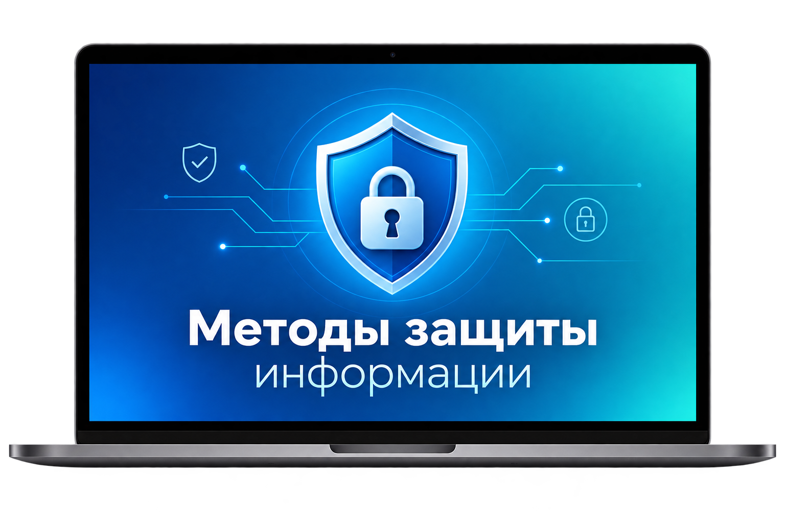

<h2 align="center">
  🍀 Методы защиты информации
</h2>

<div align="center">
  
</div>

# Оглавление курса | Методы защиты информации

[**Практическое занятие №1: Основа кибербезопасности и кибергигиена**](./FAPI1_Introduction/FAPI1_Introduction.md)  
[**Практическое занятие №2: Компьютерные сети**](./FAPI2_Endpoints%20and%20Parameters/FAPI2_Endpoints%20and%20Parameters.md)  
[**Практическое занятие №3: Основы криптографии**](./FAPI3_Processing%20requests/FAPI3_Processing%20requests.md)  
[**Практическое занятие №4: Применение криптографии**](./FAPI4_Postman/FAPI4_Postman.md)  
[**Практическое занятие №5: Защита беспроводных сетей**](./FAPI5_Async%20Types%20Cookies/FAPI5_Async%20Types%20Cookies.md)  
[**Практическое занятие №6: Веб-безопасность**](./FAPI6_Authentication/FAPI6_Authentication.md)   
[**Практическое занятие №7: Вирусы и вредоносное ПО**](./FAPI7_Roles/FAPI7_Roles.md)  
[**Практическое занятие 8: SQL Injection и безопасная работа с базой данных**](./FAPI8_Database/FAPI8_Database.md)      
[**Практическое занятие 9: XSS, CSRF и Clickjacking: защита веб-приложения**](./FAPI9_Migration/FAPI9_Migration.md)   
[**Практическое занятие №10: Методические указания к выполнению курсовой работы**](./FAPI10_Errors/FAPI10_Errors.md)      
[**Практическое занятие №11: Aнализ предметной области и описание защищаемой системы**](./FAPI11_Testing/FAPI11_Testing.md)      
[**Практическое занятие №12: Модель угроз и требования к защите информации**](./FAPI12_Integration/FAPI12_Integration.md)   
[**Практическое занятие №13: Реализация требований и функциональное тестирование**](./FAPI13_Deployment/FAPI13_Deployment.md)  
[**Практическое занятие №14: Тестирование механизмов защиты и анализ результатов**](./FAPI14_WebSocket/FAPI14_WebSocket.md)  
[**Практическое занятие №15: Оформление пояснительной записки и подготовка к защите**](./FAPI15_Implementation/FAPI15_Implementation.md)   
[**Практическое занятие №16: Итоговая защита курсовой работы по дисциплине**](./FAPI16_Conclusion/FAPI16_Conclusion.md)  

## Вопросы на сессию
[**Вопросы к сессии по дисциплине**](MZI_Questions.md)   

<br/>

<div align="center">

[](https://forthebadge.com) &nbsp;
[](https://forthebadge.com)

</div>

---

## 🚀 О проекте

Репозиторий содержит учебные материалы по дисциплине **«Методы защиты информации»** и предназначен для последовательного изучения базовых принципов информационной безопасности, современных средств защиты данных и практических подходов к безопасной разработке программных систем.

Курс построен по принципу перехода **от общих основ информационной безопасности к конкретным механизмам защиты и их практическому применению**. Теоретические сведения сопровождаются примерами, схемами, фрагментами кода, практическими заданиями, вопросами для самопроверки и самостоятельной работой.

---

## 🛠 Технологии и инструменты

- **Python 3**
- **Flask**
- **SQLite / PostgreSQL**
- **HTML / CSS / JavaScript**
- **Git**
- **curl**
- **OpenSSL**
- **Developer Tools браузера**
- **PowerShell**
- стандартные сетевые утилиты Windows, Linux и macOS
- библиотеки современной криптографии
- средства автоматизированного тестирования

Для выполнения конкретного занятия достаточно установить только те инструменты, которые указаны в соответствующем Markdown-файле.

---

## ⚡ Быстрый старт

### 1️⃣ Клонируйте репозиторий

```bash
git clone https://github.com/dv0retsky/secur-tutorial.git
```

### 2️⃣ Перейдите в папку проекта

```bash
cd secur-tutorial
```

### 3️⃣ Откройте нужное практическое занятие

Все основные материалы представлены в формате Markdown и могут изучаться непосредственно через интерфейс GitHub.

### 4️⃣ Выполните практические задания

Для занятий, содержащих программный код, создавайте отдельное рабочее окружение и следуйте инструкциям соответствующего занятия.

### 5️⃣ Проверьте себя

В конце занятий представлены контрольные вопросы, практические задания и самостоятельная работа.

---

<div align="center"> Made with ❤️ by <b>dv0retsky</b> </div>
